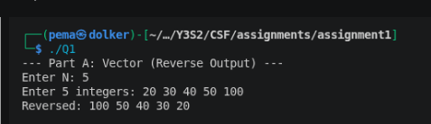
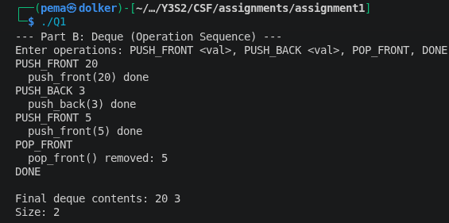
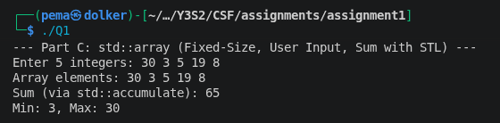

### Assignment 1 - DSA (STL, Bellman-Ford, Floyd-Warshall)
### Module code - CSF 303
### Student no : 02230294


### Overview

This assignment covers three key areas: STL containers in C++, the Bellman-Ford shortest path algorithm, and the Floyd-Warshall all-pairs shortest path algorithm. All the questions are in individual files (.cpp). Each program accepts input of its users at run times.

Files:
- `Question1.cpp`- STL containers (vector, deque, array)
- `Question2.cpp` - Bellman-Ford + negative cycle detection
- `Question3.cpp` - Floyd-Warshall + negative cycle detection

---

### Question 1 - STL Containers
Write a C++ program that demonstrates the use of Standard Template Library (STL) containers:


#### Part A - vector, reverse output

I declared a vector  of N integers that were inputted by the user which I stored in a `std::vector<int>` and then printed in reverse. The right way to do it in the STL would be to use reverse iterators (`rbegin()` and `rend()`), so that instead of counting down manually using a loop of N-1, I did it with reverse iterators. The size N is read dynamically such that it can handle any input of size up to 10^5.


```cpp
for (auto it = nums.rbegin(); it != nums.rend(); ++it) {
    std::cout << *it << " ";
}
```

Sample:




#### Part B - deque, operation sequence

In the deque section I made it interactive -- the user enters operations one at a time (PUSH_FRONT, PUSH_BACK, POP_FRONT), and once done types DONE. Every operation records its actions so that you can track along. I also included a check so having an empty deque results in a crash of POP_FRONT.

The reason deque makes sense is because push_front is O(1) on a deque, but O(N) on a vector, and thus with double-ended operations deque is the correct choice.




#### Part C — std::array, sum with STL

`std::array` is different from vector because ize of the array must be known at at least compile time, you cannot resize it. I set the size to 5 as a compile-time constant and read the values from the user. The sum is computed using `std::accumulate` from `<numeric>` rather than a manual loop, and I also used `std::minmax_element` to obtain the min and the max in a single pass.

```cpp
const int SIZE = 5;
std::array<int, SIZE> arr;
int total = std::accumulate(arr.begin(), arr.end(), 0);
```

Sample:



---

### Question 2 - Bellman-Ford

#### How the algorithm works

Bellman-Ford determines the shortest routes between a single source node to all others. The concept is edge relaxation - you consider all the edges and decide whether you can come up with a better known distance to the destination vertex. You do this V-1 times since the longest possible shortest path (with no negative cycles) visits at most V-1 edges.


```
for V-1 iterations:
    for each edge (u, v, w):
        if dist[u] + w < dist[v]:
            dist[v] = dist[u] + w
            parent[v] = u
```

I also added an early exit - if a full pass over all edges makes no update, the algorithm has already converged and there is no point doing more iterations.

#### Path reconstruction

I had an array parent[] which is a record of the way we had reached the each vertex in relaxation. After the algorithm completes, one can trace back through the parent chain to any target vertex to find the entire path. To print it in the correct sequence (source to destination) I reversed it using a stack.


#### Negative cycle detection

When V-1 passes, I make an additional relaxation pass. When any distance is again updated during this additional pass, then it indicates the existence of a negative cycle - the algorithm should now have completely converged to the extent that there is not one.

I also did a BFS on the directly affected vertices after discovering them to extend the -INF flag. The fact that a vertex is on a negative cycle implies that all the vertices that can be reached by it also have distance -INF, not just the vertices that are on the cycle itself.

#### Input / Output


Complexity: O(V x E) time, O(V) space

---

### Question 3 — Floyd-Warshall

#### How the algorithm works

On the one hand, Bellman-Ford works from a single source, and on the other hand, Floyd-Warshall calculates the shortest paths between each pair of vertices at once. It does this with three nested loops and a DP recurrence:


```
for each intermediate vertex k:
    for each pair (i, j):
        dist[i][j] = min(dist[i][j], dist[i][k] + dist[k][j])
```

The idea is that for each k, you are asking:  does the path between i and j become shorter if we are allowed to go through k? Each pair has its best answer, after all V values of k have been tried.


The matrix is initialised with direct edge weights (INF where no edge exists, 0 on the diagonal).

Complexity: O(V^3) time, O(V^2) space

#### Negative cycle detection

After running the algorithm, I check if dist[i][i] < 0 for any vertex. If a vertex has a negative path back to itself, it is on a negative cycle.

I then indicate all pairs (i, j) with -INF in case there is a negative-cycle vertex k that is on the path between i and j - i can reach k, and k can reach j. Without this the matrix would just show gibberish numbers for those pairs.


#### Distance matrix output

No negative cycle:


With a negative cycle:


#### Part D - Provide a brief explanation

**Why Floyd-Warshall works with negative edge weights:**

There is no difference between positive and negative weights in the algorithm. Each of its steps just compares two path lengths and retains the shorter. Provided the shortest paths are finite and well-defined (they have no negative cycles) the DP will reach the right answer, whether the weights are negative or positive.

**Why it fails with negative cycles:**

When there is a negative cycle somewhere, then the minimum cost path between vertices that can reach it is -infinity, you just continue round the loop and the cost decreases by the cost of the loop. There is no such mechanism in Floyd-Warshall for this; it performs its fixed rounds and leaves incorrect values in the matrix. The indication that dist[i][i] became negative is the way you know that it happened.


