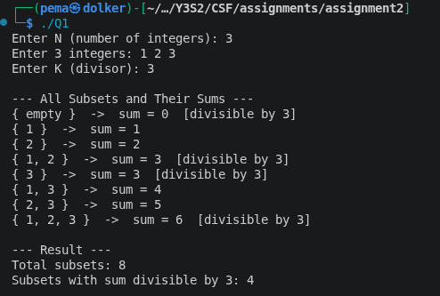

### Assignment 2 - DSA (Bitmasking, Johnson's Algorithm, Arbitrage Detection, Edmonds' Algorithm, KMP, Rabin-Karp)
### Module code - CSF 303
### Student no : 02230294
 
---
 
### Overview
 
This assignment covers six topics: bitmasking for subset enumeration, Johnson's Algorithm for all-pairs shortest paths on sparse graphs, arbitrage detection using graph-based currency modelling, Edmonds' Algorithm for minimum spanning arborescences, and two string matching algorithms using KMP and Rabin-Karp.
 
---
 
### Question 1 - Bitmasking
 
#### Part A - Generating all subsets
 
Given a set of N integers (N up to 20), any subset of N integers is represented by a bitmask of N bits. When the i th bit in the mask is set, element i is in the subset. Because N masks are possible, the combination of 0 through 2N-1 corresponds to all the subsets (a single time each).

 
```cpp
int n;
std::cin >> n;
std::vector<int> arr(n);
for (int i = 0; i < n; i++) std::cin >> arr[i];
 
for (int mask = 0; mask < (1 << n); mask++) {
    std::vector<int> subset;
    for (int i = 0; i < n; i++) {
        if (mask & (1 << i)) {
            subset.push_back(arr[i]);
        }
    }
    // process subset
}
```
 
The total number of subsets generated is 2^N. In the case of N = 20 this is 1, 048, 576 - a large number but can be handled within a sensible amount of time.
 
#### Part B - Counting subsets with sum divisible by K
 
For each bitmask, the sum of the elements included is calculated and tested whether it is divisible by K with modulo operator.

 
```cpp
int k, count = 0;
std::cin >> k;
 
for (int mask = 0; mask < (1 << n); mask++) {
    int sum = 0;
    for (int i = 0; i < n; i++) {
        if (mask & (1 << i)) {
            sum += arr[i];
        }
    }
    if (sum % k == 0) count++;
}
std::cout << "Count: " << count << std::endl;
```
 
**Complexity:** O(2^N × N) time, O(N) space (for the current subset). Since N ≤ 20, the worst case is about 20 million operations, which runs comfortably within time limits.
 



---

### Question 2: Johnson's Algorithm

####  Part A - Why Johnson's Algorithm is more efficient than Floyd-Warshall for sparse graphs

The running time of **Floyd-Warshall** does not depend on the number of edges, and is **O(V³)**. It uses dynamic programming on all pairs of vertices so even in a highly sparse graph it does the same thing - it is not at all sensitive to the density of the graph.


**Johnson's Algorithm** runs in **O(V² log V + VE)**. It is efficient because it merely requires running the algorithm of Dijkstra once per vertex (V times), and once with a binary heap (Dijkstra) runs in log V(V + E) per run, and thus runs in O(V V log V + VE), which simplifies to O(V log V + VE).

For a **sparse graph**, E ≪ V², so:

| Algorithm | Time Complexity | Sparse Graph (E ≈ V) |
|---|---|---|
| Floyd-Warshall | O(V³) | O(V³) |
| Johnson's | O(V² log V + VE) | O(V² log V) |

**The key insight:** Floyd-Warshall's cubic complexity is fixed. Johnson takes advantage of sparseness of the graph - the fewer the number of edges, the quicker Dijkstra is.

---

## Part B - Edge reweighting and Bellman-Ford.

**The Problem with Dijkstra on Negative Weights:**
Dijkstra's algorithm does not work when the weights of the edges are negative since its greedy assumption, that the shortest path is determined when a node has been settled, fails when a subsequent negative edge can create a shorter path. To make Johnson algorithm work, negative edges should be removed without altering shortest paths, that is, Dijkstra should be used.

**Edge Reweighting — Solution:**

The Algorithm of Johnson can deal with negative edge weights by redefining all the edges as non-negative, without altering the shortest path.

The process is:

1. Add a zero-weight vertex s to each other vertex.
2. Bellman-Ford(s) to calculate a potential function h[v] - the shortest path between s and every vertex v.
3. Reweight each edge ŵ(u, v) = w(u, v) + h[u] - h[v]

This transformation has two critical properties:
1. **All reweighted edges become non-negative** — safe for Dijkstra
2. **Shortest paths are preserved** —in case a path P is shortest with original weights, it is also shortest with reweighted values, since on any route between s and t, the h() terms telescope and cancel out:

Once shortest paths have been computed in the reweighted graph, the original distances can be obtained by inverting the transformation.

This initial stage makes use of Bellman-Ford due to its ability to correctly deal with negative edge weights, something that Dijkstra cannot. It is also a negative-cycle detector - in the event that Bellman-Ford reports a negative cycle, then Johnson halts its Algorithm because shortest paths are not well-defined and It only runs **once** — O(VE) — which is acceptable as a preprocessing step


# Question 3: Arbitrage Detection in Currency Exchange

## Part A : Modeling the currency exchange problem as a weighted directed graph.

The currency exchange in terms of currency is modelled as:

- **Vertices (V):**  currencies
- **Directed Edges (E):** An edge between vertex u and vertex v is a directed edge
- **Edge Weight:** weight of edge (u → v) is the exchange rate r(u,v) .


The currencies are depicted in the form of a vertex. Given any exchange rate between currency A and currency B, where the rate is r, an directed edge is added between vertex A and vertex B whose weight is the rate r. The graph is completely directed as the exchange rates are not always symmetric (the rate of USD to EUR can be different to EUR to USD).

This means that there is an **arbitrage opportunity** in case there is a cycle in this graph such that the product of the exchange rates through the cycle is more than 1 - that is, that you may start with a certain amount of currency, follow the cycle, and come out with more than you initially had.


```
r(u→v) × r(v→w) × r(w→u) > 1
```


### Part B: Logarithmic transformation.

It is not a typical shortest-path problem to directly find cycles in which the product of weights is greater than 1. The change to convert it into one is to take the negative logarithm of every exchange rate:

**The Transformation:**
Replace each edge weight r(u, v) with:

```
edge weight = -log(exchange_rate)
```

**Why this works:**

An arbitrage cycle satisfies:
```
r₁ × r₂ × r₃ × ... × rₖ > 1
```

Taking log of both sides:
```
log(r₁) + log(r₂) + ... + log(rₖ) > 0
```

Negating (to convert to our edge weights):
```
-log(r₁) + (-log(r₂)) + ... + (-log(rₖ)) < 0
```

In this transformation, multiplication of rates along a path is added logarithms, and a product more than 1 is added to a sum less than 0. This means that an arbitrage opportunity is precisely a negative-weight cycle in the transformed graph. This transforms the problem to a conventional negative cycle detection problem.


### Part C - Algorithm used and justification

**Algorithm: Bellman-Ford**

With the logarithmic transformation, the issue is now to identify a negative-weight cycle in a directed graph. The right algorithm to do this is Bellman-Ford.

**How Bellman-Ford detects negative cycles:**

Once the logarithmic transformation has been implemented, the algorithm is implemented on the transformed graph. When a relaxation still exists after V-1 iterations,it satisfy:

```
dist[v] > dist[u] + w(u, v)
```

- then a negative cycle exists in the transformed graph, and relates to an arbitrage opportunity in the original currency exchange graph.

Bellman-Ford is the right one in this case since:
- It supports negative edge weights, which come about due to the log transformation of rates below 1.
- It explicitly finds negative cycles, which is precisely what must be found.
- Dijkstra cannot be used since it does not support negative weights.

**Dijkstra cannot be used here** since it does not support negative edge weights, and does not have any way to identify negative cycles.

<!-- **Complete Arbitrage Detection Pipeline:**
```
1. Build graph: vertices = currencies, edges = exchange rates
2. Transform weights: w(u,v) = -log(rate(u,v))
3. Run Bellman-Ford (V-1) times.
4. On the Vth iteration, check if any edge can still be relaxed
5. If yes → negative cycle exists → ARBITRAGE OPPORTUNITY FOUND
```
 -->


# Question 4: Edmonds' Algorithm

##  Problem solved by Edmonds’ Algorithm .

The Algorithm of Chu-Liu/Edmonds (named also as Algorithm of Edmonds) is an algorithm to solve the Minimum Spanning Arborescence problem:

Given a directed graph with weights and a given root vertex r, we seek a spanning arborescence with root r - a directed spanning tree in which all nodes except root r have exactly one incoming edge, and in which all nodes are reachable by the root r - with total weight minimised.

This is a directed version of the minimum spanning tree problem. In contrast to undirected MST (solved by Kruskal algorithm or Prim algorithm), the directed version cannot rely on either of the algorithms since edge directionality implies that the minimum incoming edge at a vertex can be in a cycle that must be contracted and solved in an iterative fashion. Edmonds' Algorithm handles this by greedily selecting the minimum-weight incoming edge for each non-root vertex, detecting and contracting cycles, then recursively solving the reduced graph. It has a time complexity of O(E V), or O(E V log V) with a Fibonacci heap.

**Practical applications:** Network broadcast trees, dependency resolution, optimizing directed communication networks, and finding optimal root-to-all routing in directed graphs.


# Question 5: String Matching Algorithms

## Part A - KMP: LPS Array of "ABABCABAB"

### What is the LPS Array?

The Longest Prefix Suffix (LPS) array is an array of the length of the longest proper prefix of the substring pattern[0i] which is also a suffix of the substring pattern[0i]. "Proper" means the prefix/suffix cannot be the entire string itself.

This allows KMP to **skip redundant comparisons** on mismatch — instead of restarting from the beginning of the pattern, it jumps to the position indicated by LPS.


### Step-by-Step LPS Computation

**Pattern:** `A B A B C A B A B`  
**Index:**  `0 1 2 3 4 5 6 7 8`

We maintain two pointers:
- `len` → length of the previous longest prefix suffix (starts at 0)
- `i` → current position being computed (starts at 1)
- `LPS[0]` is always **0** by definition


**i = 1, char = 'B'**
```
Compare pattern[1]='B' vs pattern[0]='A' → MISMATCH
len = 0, so LPS[1] = 0
```

**i = 2, char = 'A'**
```
Compare pattern[2]='A' vs pattern[0]='A' → MATCH
len becomes 1, LPS[2] = 1
```

**i = 3, char = 'B'**
```
Compare pattern[3]='B' vs pattern[1]='B' → MATCH
len becomes 2, LPS[3] = 2
```

**i = 4, char = 'C'**
```
Compare pattern[4]='C' vs pattern[2]='A' → MISMATCH
len > 0, so fall back: len = LPS[len-1] = LPS[1] = 0
Compare pattern[4]='C' vs pattern[0]='A' → MISMATCH
len = 0, so LPS[4] = 0
```

**i = 5, char = 'A'**
```
Compare pattern[5]='A' vs pattern[0]='A' → MATCH
len becomes 1, LPS[5] = 1
```

**i = 6, char = 'B'**
```
Compare pattern[6]='B' vs pattern[1]='B' → MATCH
len becomes 2, LPS[6] = 2
```

**i = 7, char = 'A'**
```
Compare pattern[7]='A' vs pattern[2]='A' → MATCH
len becomes 3, LPS[7] = 3
```

**i = 8, char = 'B'**
```
Compare pattern[8]='B' vs pattern[3]='B' → MATCH
len becomes 4, LPS[8] = 4
```


### Final LPS Array

```
Pattern:  A  B  A  B  C  A  B  A  B
Index:    0  1  2  3  4  5  6  7  8
LPS:      0  0  1  2  0  1  2  3  4
```

### Verification of Key Entries

Char Index LPS value Reasoning
|-------|------|-----------|-----------|
| 0 | A 0 0 0 No proper prefix/suffix can have one character.
| 1 | B | 0 | "AB" — no prefix that matches a suffix |
| 2 | A | 1 | "ABA" — prefix "A" matches suffix "A" |
| 3 | B | 2 | "ABAB" — prefix "AB" matches suffix "AB" |
| 4 | C | 0 | "ABABC" — no match |
| 5 | A | 1 | "ABABCA" — prefix "A" matches suffix "A" |
| 6 | B | 2 | "ABABCAB" — prefix "AB" matches suffix "AB" |
| 7 | A | 3 | "ABABCABA" — prefix "ABA" matches suffix "ABA" |
| 8 | B | 4 | "ABABCABAB" — prefix "ABAB" matches suffix "ABAB" |
 
**LPS array:** `[0, 0, 1, 2, 0, 1, 2, 3, 4]`
 
The LPS array is invoked at the search stage to prevent unnecessary comparisons - when the mismatch at position i in the pattern, the search will proceed at LPS[i-1] rather than searching at the beginning.


## Part Rabin-Karp: Hash Collisions and Complexity.: 


**Handling hash collisions:**
 
RabinKarp compares the pattern with each window of the text by using a rolling hash. Due to the possibility of collisions (different strings hash to the same value), a match by the hash is considered merely a candidate match. Every time the hash of the current window matches the hash of the pattern, the algorithm will then do a complete character-by-character comparison to verify whether the match is a true one. This check can be used to verify that things are correct - spurious hits due to hash collisions do not cause false positives, but they introduce a little overhead.
 
**Time complexities:**
 
| Case | Complexity | Reason |
|------|------------|--------|
| O(N + M) | Rolling hash Checks every window in O(1); a small number of spurious hits
| O(N × M) O(M)/window Checking To verify each window, it must check its hash, taking O(M) time.
 
N is the length of the text, M is the length of the pattern.
 
The worst case is not implemented in practice, and only occurs in cases where the hash function is poorly chosen or the input is adversarial. Having a decent polynomial rolling hash and a large prime modulus, the probability of a spurious hit is extremely small, maintaining the average-case performance at O(N + M).
 
---